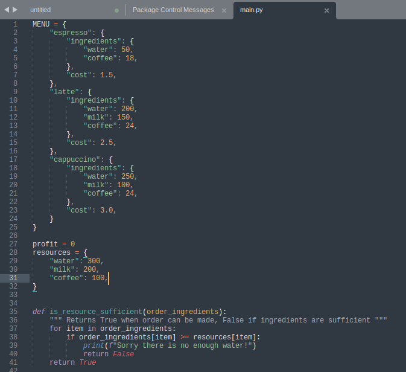
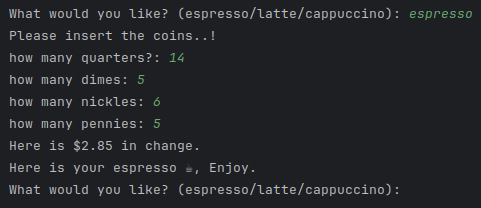

# Coffee Machine Program

A simple Python program for a coffee machine that can produce espresso, latte, and cappuccino.

## Features

- Choose from three different types of coffee: Espresso, Latte, and Cappuccino.
- displaying warning message if machine has no enough resources to make coffee.
- Easy-to-use interface for a delightful coffee-making experience.

## Prerequisites

Make sure you have Python installed on your machine. You can download it from [python.org](https://www.python.org/).

## How to Run

1. Clone the repository to your local machine:

   ```bash
   https://github.com/kcvaghasiya/CoffeeMachine.git

2. Navigate to the project directory:

   ```bash
   cd coffee-machine-program

3. Run the program:

   ```bash
   python main.py

4. Follow the on-screen instructions to make your desired coffee.

   ## Usage
      - Choose the type of coffee you want (Espresso, Latte, Cappuccino).
      - Make payment for purchased coffee and calculate profit.
      - Enjoy your delicious coffee!

   
   

## Contributing
If you'd like to contribute to the project, feel free to open issues or submit pull requests.

# License
This project is licensed under the MIT License - see the LICENSE file for details.
